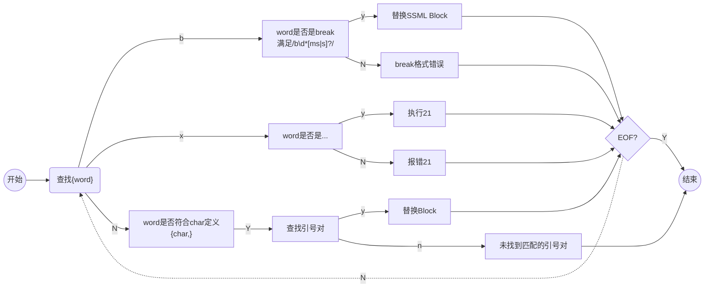

处理流程



```ruby
{ character | style, styledegree, role }
```

```ruby
# strenght: none、x-weak、weak、medium、strong、x-strong
# time: 500ms、2s
{ b/break | strenght/time }
```

```ruby
# type: Leading、Tailing、Sentenceboundary
# value: 500ms、2s
{ s/silence | type, value}
```

